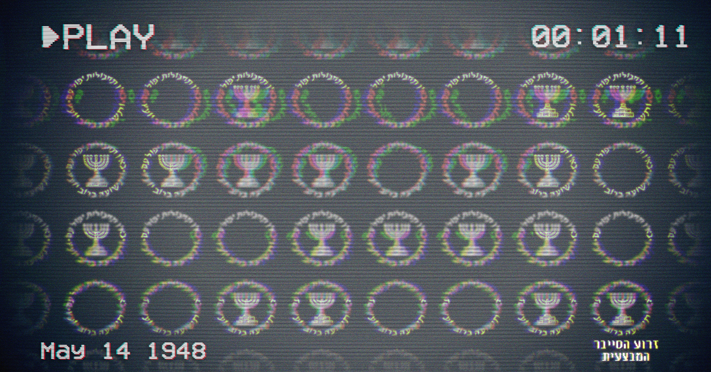

### Mossad Challenge 2019

To get into Challenges Web Page you need to find IP Address from Image below:

Here is how to I find it:

Here is my video on how to find it: https://youtu.be/T55p6KG1UB0

## Challenge-1

1. Download `app.apk` file from http://3d375032374147a7865753e4bbc92682.xyz/static/app.apk
This is Android application, you can install it on your Android device, recommend to use some Android Emulator, and not your main private phone.
In your Android you need to enable Install from unknown sources!!!

2. To install application, in your Android device open browser and goto `http://3d375032374147a7865753e4bbc92682.xyz/static/app.apk` it will start downloading, after download complete, try to open this file from file manager or any other way and Andorid will ask your permission to install.

3. You will see this screen after you launch this app:

Since we only have Our `Client ID#  6711d2ec0d724396ad1570fcfb431443`
We need first hack application to allow us to enter without login, and reinstall it on our Andorid device.
Remember when you change any file you have to update SHA1-Digest of thi file in `META-INF/MANIFEST.MF` file 

## Challenge-2
To Be Resolved

## Challenge-3
To Be Resolved
