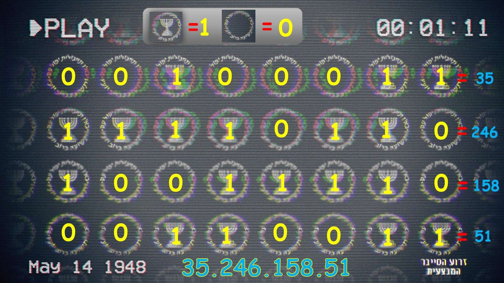
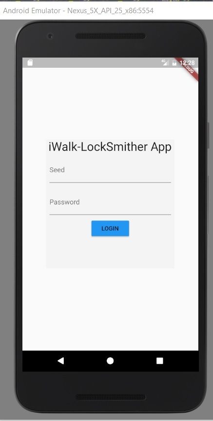
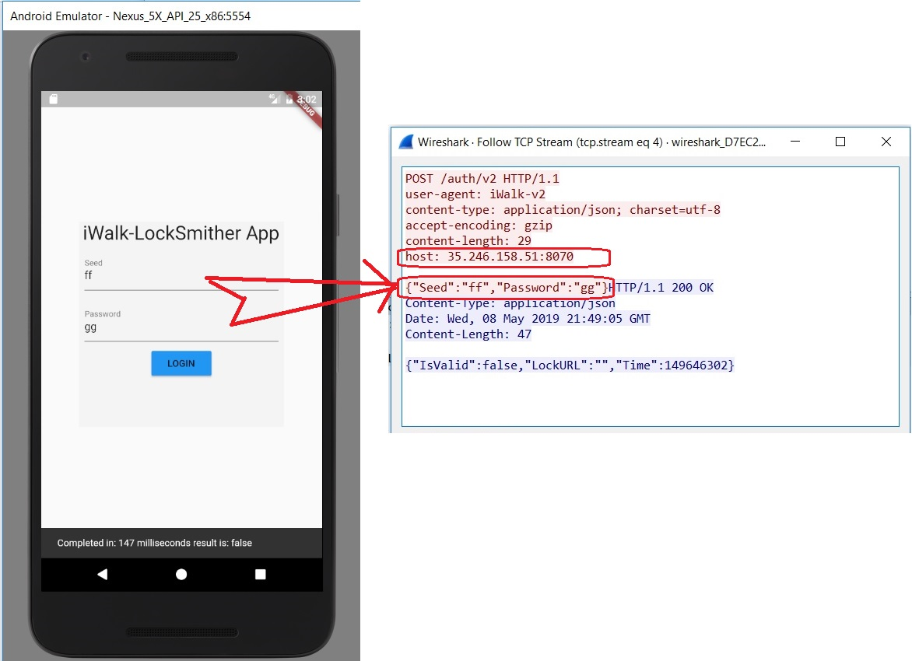
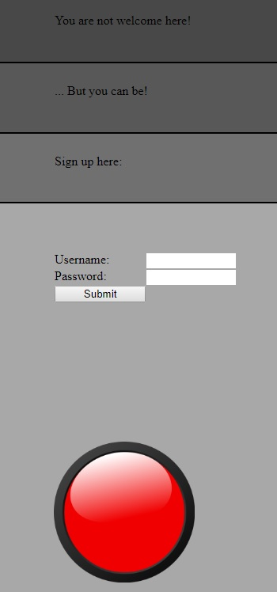

### Mossad Challenge 2019

To get into Challenges Web Page you need to find IP Address from Image below:


Here is how to I find it:


Here is my video on how to find it: https://youtu.be/T55p6KG1UB0


## Challenge-1

1. Download `app.apk` file from http://3d375032374147a7865753e4bbc92682.xyz/static/app.apk
This is Android application, you can install it on your Android device, recommend to use some Android Emulator, and not your main private phone.
In your Android you need to enable Install from unknown sources!!!

2. To install application, in your Android device open browser and goto `http://3d375032374147a7865753e4bbc92682.xyz/static/app.apk` it will start downloading, after download complete, try to open this file from file manager or any other way and Andorid will ask your permission to install.

3. You will see this screen after you launch this app:


Since we only have Our `Client ID#  6711d2ec0d724396ad1570fcfb431443`
We maybe need hack application to allow us to enter without login, and reinstall it on our Android device.
Remember when you change any file you have to update SHA1-Digest of thi file in `META-INF/MANIFEST.MF` file 

4. I analyzed network packets by using Wireshark which app send during login:
As you can see it send POST request to `35.246.158.51:8070`
```
POST /auth/v2 HTTP/1.1
user-agent: iWalk-v2
content-type: application/json; charset=utf-8
accept-encoding: gzip
content-length: 29
host: 35.246.158.51:8070

{"Seed":"ff","Password":"gg"}HTTP/1.1 200 OK
Content-Type: application/json
Date: Wed, 08 May 2019 21:49:05 GMT
Content-Length: 47

{"IsValid":false,"LockURL":"","Time":149646302}
```
<br>

Looks like Destination Host it's API endpoint.
You can generate same POST Request to server by using *curl* command:

`curl -X POST -d '{"Seed":"xxxxx","Password":"yyyyyy"}' 35.246.158.51:8070/auth/v2`

And get respond with same format:
```
{
    "IsValid": false,
    "LockURL": "",
    "Time": 158262
}
```

## Challenge-2
http://759d8eba52184f538c8a4525680cfb33.xyz/

Not Welcome WebSite: http://missilesys.com/notwelcome <br>
Red Button Image loading from another website.<br>
Can be Welcome WebSite: https://dev.missilesys.com/ <br>
<br>

You can register and get Certificate to login.
Funciton `gencsr` called from https://dev.missilesys.com/js/PKCS10.js to generate cert.

## Challenge-3
To Be Resolved
